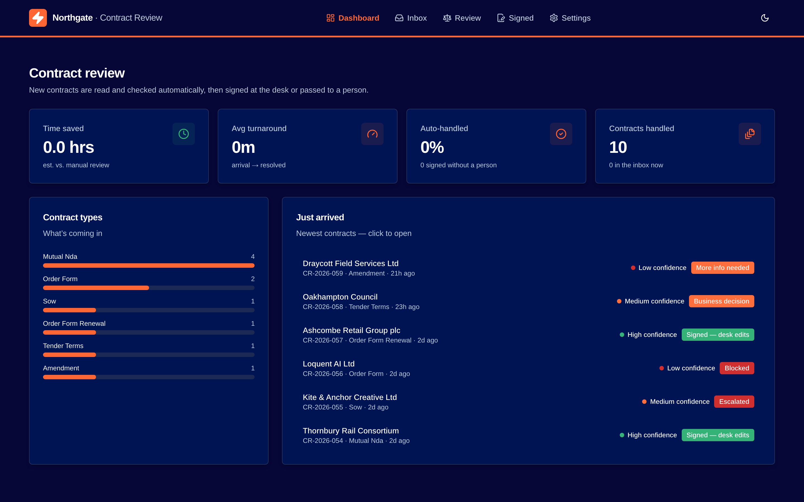
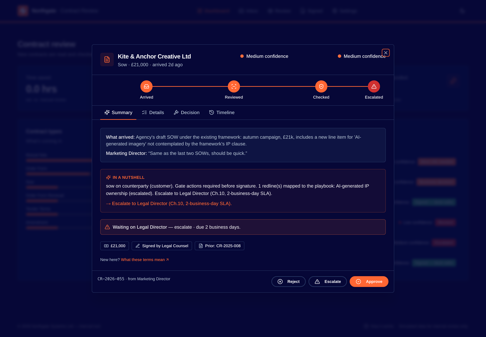

# Contract Triage

An end-to-end demo that turns a legal team's contract-review judgement into a
running application — an agent workflow that reads what lands in the inbox,
decides what to do with it, and knows when to stop and ask a human.

Paste any one contract into a chat model and you'll get sound edit advice back —
so the fair question a skeptic should ask is why this is an application and not a
prompt. Because the edit advice was never the expensive part. Today a qualified
reviewer opens **all** 79 contracts to find the ~8% that are genuinely hard; the
other 92% needed the same handful of moves, or none at all. Copy-and-paste doesn't
change that — a human still opens each one, pastes it, and reads the answer. The
reviewer's attention, the most expensive line in the function, is spent in full
*before* the model is any use.

This is the layer that removes the opens. Contracts land in an inbox and sort
themselves: the third that need no edits clear, the quarter that need one known
move are redlined to the playbook, and only the hard cases surface — already
pre-triaged, with the proposed redlines and their legal basis attached. And it
does it the way a legal function requires and a chat window can't: the **same
policy applied every time** (not a fresh opinion per prompt), an **audit trail on
every decision**, and a **hard stop that pauses for a human** on the calls a
machine shouldn't own. A legal team can't sign a contract because a chatbot said
it looked fine — that accountability layer, not the extraction, is the product.

> **The one number:** a reviewer used to open all 79 contracts just to find the
> ~8% that were genuinely hard. Clearing the third that need no edits and
> one-move-redlining the quarter that need one takes **6 in 10 off the desk before
> anyone opens a thing** — and the hard reviews stop waiting in line behind the
> routine ones that never needed a lawyer.

---

## What it is — and the problem it solves

Contract Triage is a working demo of a legal contract-triage solution. Contracts
are ingested in the UI into an inbox, and from there handed to an **agentic
workflow** that determines where each one should go — **cleared** and signed
as-is, **redlined to a known playbook position**, or, when it hits something a
machine shouldn't decide alone, **paused and escalated to a human** — and drops
it into the right queue for the reviewer. The reviewer stops reading everything
and reads only what's been flagged as worth their time.

For this demo, we scoured through **79 processed contracts** with full edit logs,
and the shape of the work is stark:

| Edits needed | Share | What it means |
|---|---|---|
| **0 edits** | **34%** | signed as-is — auto-clear |
| **1 edit** | **25%** | one known move — one-tap redline |
| **2 edits** | **22%** | two known moves — redline |
| **3+ edits** | **~19%** | of which only **~8%** are genuinely bespoke |

**34%** were signed with zero edits, another **25%** needed exactly one, and
**22%** needed two — leaving only **~8%** that are genuinely bespoke,
escalation-worthy reviews. The **92%** in between is the
same handful of moves on repeat: an uncapped liability clause pulled back to
twelve months' fees, net-60 payment terms pushed to net-30, an auto-renewal
struck out. This is what most legal teams actually look like — a small core of
hard, judgment-heavy work buried under a routine majority — and the expensive
part isn't the hard 8%. It's that a qualified reviewer has to **open every
contract just to learn which bucket it's in**. The reviewer's time is the most
expensive line in the function; auto-clearing the third that needs no edits and
one-move-redlining the quarter that needs one takes **well over half the manual
opens off their desk**, and the reviews that genuinely need a lawyer stop waiting
behind the ones that never did.

This is a modest problem on the surface — 80% boilerplate NDAs — so the fair
challenge is whether the register of record, the traces, the bounded loops, the
held-out eval split and the human gate are over-built for it. They aren't: the
moment a legal team acts on a disposition, every one of those stops being
gold-plating and becomes the thing that makes the disposition safe to act on. The
easy 20% is the extraction; the reason for the other 80% of the engineering is
that consistency, traceability, and termination are what a review function can
defend — and a chat window can't produce.



## How it works

The system is an **agentic workflow** shaped as a graph. A contract enters as a
flat set of intake facts and flows through nodes that each read and write one
shared `TriageState`. The judgments the workflow turns on — how to classify the
paper, which policy gates fire, how each redline maps to the playbook — are made
by an **LLM** (an **OpenAI** chat model in this demo, but the client is pluggable
and swaps out for Azure OpenAI or any other provider with a key change). The
graph is the orchestration *around* those calls — routers, a parallel fan-out,
the human gate — so the moving pieces are wired predictably while the
intelligence lives in the model:

1. **Intake** — read the source PDF, fill in any blank intake fact from the
   document, and gate obvious non-starters (missing info, out of scope).
2. **Classify** — what *kind* of paper is this? NDA, order form, DPA, SOW,
   amendment; our paper or theirs; what data does it touch; what's it worth. An
   LLM reads the document and returns this as a structured classification; the
   graph around it stays deterministic control flow, so the *path* a contract
   takes is always a pure function of that classification.
3. **Policy-gate fan-out** — three validators (data protection, information
   security, insurance & liability) run in parallel and are gathered back. These
   fire on *facts about the deal*, not on redlines — a customer-paper DPA gates
   whether or not anyone asked to change a word.
4. **Negotiability + bounded redline loop** — for anything negotiable, each
   problem clause is mapped to a fixed **playbook position**: the standard ask,
   the fallback, and the line we refuse to cross. The loop is deliberately
   bounded so it always terminates.
5. **The human gate** — the one re-entrant interrupt. When the graph reaches
   something it shouldn't decide alone (an escalation, a business trade-off), it
   *pauses the run*, drops the contract into the reviewer's queue, and waits.
   The reviewer's decision — resolve, decline, escalate — resumes the exact same
   run from where it stopped.
6. **Approval / disposition** — the contract lands in a terminal state and the
   queue it belongs to: **approved**, **quarantined**, or still **pending**.

The console **ships with an empty inbox** — the reviewer adds the first contract.
The **New Contract** button (top-right, and the empty-inbox call-to-action) opens
a modal, and on submit the backend **persists** the intake to SQLite, **stores**
the uploaded PDF in the object store, and **triggers the graph** — whose terminal
nodes write the outcome straight back to SQLite. (Prefer a pre-populated demo?
Set `SEED_EXAMPLES=1` to load the ten canonical example contracts on boot and
triage them eagerly, so the queues open warm.) Both routes read and write one
register, so a contract created
in the UI is immediately visible to the graph and vice-versa (see
[Adding a contract](#adding-a-contract-the-new-contract-flow) below).

The reviewer sees all of this in a console: the queues, a detail view for each
contract — its classification, which gates fired, the proposed redlines with
their legal basis, the forward obligations — and the decision graph with *this*
contract's path lit up. When a run pauses at the human gate, the same view is
where the reviewer resolves, escalates, or declines it.



The agent is **LLM-first**: the model makes every substantive judgment the graph
routes on — the classification, the policy gates, the redline→playbook mapping —
plus the plain-English explanation, all as structured calls grounded in the
corpus and the playbook. A chat client is therefore **required**: drop an OpenAI
/ Azure OpenAI key into `app/agent/.env` (without one the triage nodes raise
`LLMUnavailableError`). The `workflow.py` graph is pure control flow — routers,
fan-out/in, the human gate — so only the judgments *inside* the nodes are the
model's. The test suite swaps the model for a deterministic, corpus-grounded
double so the graph is exercised offline with no API calls.

## Approach (the tech stack)

The repo is three top-level folders, each a clean layer, with a root
**`Makefile`** as the entry point — `make up` brings up the whole stack (the
Langfuse + MinIO containers plus the three app processes) in one command.

- **`app/`** — the application itself:
  - **`app/agent/`** — a **[Microsoft Agent Framework](https://github.com/microsoft/agent-framework)**
    workflow (the decision graph above) exposed two ways: a **FastAPI** REST
    surface the console consumes, and the **Agent Framework DevUI** for stepping
    through a run interactively — including driving the human-gate interrupt by
    hand. Python 3.12, managed with **[uv](https://docs.astral.sh/uv/)**.
  - **`app/frontend/`** — a **Next.js 14** review console: contract queues, a
    rich detail modal, and the live agent graph.
  - **`app/scripts/`** — small helper utilities (e.g. `make_sample_contract.py`).
- **`data/`** — the domain corpus: the contract registers, the policy library,
  the reviewed `contracts/` back-catalogue, the `test/` intake fixtures, and the
  held-out `evals/` set.
- **`docs/`** — the decision framework, the requirements, the `agent-graph.mmd`
  diagram, the canonical `models.py` domain types, and the design audit.

Underneath, **SQLite** is the register of record — the contract intake rows
(whatever the reviewer creates, plus the ten demo examples when `SEED_EXAMPLES=1`),
the computed triage results (so the queues are warm the instant the API answers),
and the outcomes the
agent's own terminal nodes write — all read back through one **repository** that
both the API and the workflow share. **MinIO** holds the intake PDFs and hands
out short-lived presigned URLs, and a self-hosted **[Langfuse](https://langfuse.com)**
stack captures the Agent Framework's **OpenTelemetry** traces — every triage run
shows up as a span tree with prompts, responses, token usage and latency.

```
                ┌───────────────────────── local stack (make up) ───────────────────────────┐
                │                                                                            │
   browser ───► │   frontend (Next.js :3000) ──HTTP──► api (FastAPI :8000) ──► Agent          │
                │            │                                              Framework workflow │
                │            └──link──► devui (Agent Framework DevUI :8080) ──┘                │
                └────────────────────────────────────────────────────────────────────────────┘
```

The graph in `agent-graph.mmd` maps directly onto the code:

| agent-graph.mmd | code |
|---|---|
| shared `State` | `app/agent/contract_triage/state.py` — `TriageState` |
| nodes / routers / validators / HITL | `app/agent/contract_triage/executors.py` |
| graph wiring (switch-case, fan-out/in) | `app/agent/contract_triage/workflow.py` |
| classification + playbook judgment (the LLM brain) | `app/agent/contract_triage/agents.py` |
| the 10 demo inbox items (opt-in seed via `SEED_EXAMPLES=1`) | `app/agent/contract_triage/data.py` |
| SQLite register + repository (API & agent share it) | `app/agent/contract_triage/db.py` · `repository.py` |
| object store — intake PDFs, presigned URLs, uploads | `app/agent/contract_triage/storage.py` |

And the FastAPI surface the console speaks:

| Method | Path | Purpose |
|---|---|---|
| `GET`  | `/api/health` | liveness |
| `GET`  | `/api/contracts` | inbox + triage summaries |
| `POST` | `/api/contracts` | create a contract (multipart: intake fields + PDF), then triage it |
| `GET`  | `/api/contracts/{id}` | full triage detail |
| `GET`  | `/api/contracts/{id}/document` | redirect to a presigned PDF URL |
| `POST` | `/api/contracts/{id}/triage` | run the workflow for one contract |
| `POST` | `/api/contracts/{id}/resolve` | resume a paused human-gate run (`{decision, note}`) |
| `GET`  | `/api/workflow/graph` | nodes/edges for the graph view |
| `GET`  | `/api/policies` | the policy register |

## How to run

**Prerequisites:** Python 3.10+ and [`uv`](https://docs.astral.sh/uv/) ·
Node ≥ 20.19 · Docker (for the Langfuse trace stack + object stores) · an
`OPENAI_API_KEY` (triage is a real LLM call — put it in `app/agent/.env`).

```bash
make install   # one-time: Python venv + frontend deps
make up         # bring up the whole stack — Ctrl-C to stop
```

`make up` starts the Langfuse + MinIO containers (detached), then runs the three
app processes — DevUI (:8080), API (:8000) and frontend (:3000) — in the
foreground. Ctrl-C stops the app processes; the containers keep running, so
`make up` again restarts fast. `make down` stops the containers (`make clean`
also wipes their volumes). Run `make` with no target to list every command.

### Where things live

| Service | URL |
|---|---|
| Review console (frontend) | http://localhost:3000 |
| Triage API (FastAPI)      | http://localhost:8000/api/health |
| Agent Framework DevUI     | http://localhost:8080 |
| Langfuse (traces)         | http://localhost:3001 |

Langfuse signs in with **`admin@northgate.local` / `langfuse-admin`** — the
project and API keys are provisioned headlessly, so traces land in the
**Contract Triage** project with no setup. Because every triage decision is an
LLM call, each run's span tree includes the `chat` spans — prompts, responses,
token usage and latency — under the workflow span.

## Adding a contract (the "New Contract" flow)

The console isn't read-only. The **New Contract** button (top-right of every
page) opens a modal to capture the intake facts — counterparty, who it came
from, what arrived, the sender's ask, related contracts — and attach the intake
PDF. Submitting it posts a multipart form to `POST /api/contracts`, and the
backend runs the whole pipeline **in order**:

1. **Persist to SQLite.** The repository (`repository.py`) allocates the next
   `CR-<year>-NNN` id and writes the intake row to the `contracts` table with
   `source='user'` (alongside the demo examples if `SEED_EXAMPLES=1`). The register
   is the single source of truth both the API and the workflow read.
2. **Store the PDF.** The uploaded document is put into the `contracts` MinIO
   bucket (so the console gets a short-lived presigned URL) and mirrored to a
   local path the ingest node reads.
3. **Trigger the agent.** The same graph runs on the new contract. Any intake
   fact left blank is derived from the PDF at ingest, the LLM classifies it, the
   gates fire, and it lands in a terminal state.
4. **The agent writes its outcome back to SQLite.** Every terminal/pause node
   passes through `executors.finalize`, which records the outcome to the
   `triage_outcomes` table (`db.save_outcome`) — the graph persists its own
   result, not just the API layer.

The freshly triaged detail comes straight back to the console, and the new
contract shows up in its queue. Because everything is persisted, it survives an
API restart — the queues rehydrate from SQLite with no re-triage.

Need a document to try it with? Generate a sample intake PDF (no dependencies):

```bash
python app/scripts/make_sample_contract.py sample-contract.pdf
```

Then either attach it in the modal, or drive the endpoint directly:

```bash
curl -X POST http://localhost:8000/api/contracts \
  -F 'counterparty=Meridian Freight Solutions Ltd' \
  -F 'received_from=AE (sales)' \
  -F 'file=@sample-contract.pdf;type=application/pdf'
```

## Benchmarks — how we know it's grounded

There is no single accuracy number to wave around, because the interesting claim
isn't "the model is X% accurate" — it's "every decision the graph makes traces
back to something that actually happens in the corpus." Three things back that up:

- **The evidence base.** The decision framework
  ([`docs/decision-framework.md`](docs/decision-framework.md)) is derived from
  **79 processed contracts** with full edit logs. The edit distribution (34% /
  25% / 22% / 19% for 0 / 1 / 2 / 3–4 edits) and the playbook-citation frequency
  (50 citations across 39 contracts, dominated by a handful of sections —
  governing law, liability cap, payment terms, renewal) are what shape the
  branches. No branch exists that the corpus doesn't justify; citations run
  throughout.
- **A test suite that pins the graph.** **57 tests** across
  [`app/agent/tests/`](app/agent/tests/) exercise the workflow node-by-node —
  including the SQLite register, the "New Contract" create flow, and the outcome
  the agent's terminal nodes persist.
  Every router branch is pinned at least once, and `test_routing.py` asserts the
  "ends *here*, not *there*" contrasts (fast-path vs. full review, gate
  short-circuits, the human-gate resume paths). To stay hermetic they swap the
  LLM brain for a deterministic, corpus-grounded double, so no live calls are
  made; the source PDF is still genuinely read off disk on every case, and the
  metadata steers the branch deterministically.
- **A held-out split for scoring.** [`data/evals/`](data/evals/) holds **20
  reviewed contracts** in two parallel copies — `without-edits/` (the contract as
  it arrived, the input) and `with-edits/` (the same contract after human review,
  the gold output). A triage run against the first is scored against the second.
  [`data/test/`](data/test/) is the **10-item live inbox** (`CR-2026-050`…`059`)
  with no gold output — the set the running app triages.

## Caveats

- **It's a demo, and the intelligence is the LLM.** The model makes every
  classification, gate and redline call, prompted against the corpus and the
  playbook — so it generalises beyond fixed rules, but a run now needs a
  reachable API and a key, and its judgments carry the usual model caveats
  (variance, the odd wrong call). The deterministic double lives only in the
  tests, for reproducibility, and is not the runtime source of truth.
- **The eval split is scaffolding, not an automated scoreboard.** The
  `without-edits` → `with-edits` gold split is in place, but there's no committed
  harness that runs the 20 and prints a score — that comparison is left as the
  next step.
- **The human loop is bounded on purpose.** To guarantee termination, a resumed
  human-gate run routes to `approval` rather than looping back to `classify` as
  the abstract diagram shows. And `loop_control`'s `maxed` branch can't be
  reached end-to-end under the deterministic test double, so it's pinned at the
  node level instead.
- **`app/agent/contract_triage/models.py` is a vendored copy** of
  `docs/models.py` so the agent stays a self-contained, deployable package —
  keep the two in sync if the domain types change.
- **The Langfuse credentials are demo defaults** in
  [`e2e/docker-compose.langfuse.yml`](e2e/docker-compose.langfuse.yml) and
  [`e2e/stack.env`](e2e/stack.env), and `ENABLE_SENSITIVE_DATA=true` captures
  prompts and responses — dev only, never point it at anything real.

---

See [`app/agent/README.md`](app/agent/README.md) and
[`app/frontend/README.md`](app/frontend/README.md) for the layer-level detail.
