# Contract Review Decision Framework

Derived from the full corpus: 79 processed contracts (2025 + 2026 registers and per-contract
edit logs), the Northgate Contract Playbook v4, the six supporting policies, and the shape of
the 10 untriaged inbox items. Every branch below is grounded in a pattern that actually occurs
in the corpus; citations are given throughout.

---

## 1. What the corpus shows (evidence base)

**Volume & effort distribution** (79 contracts with edit logs):

| Edits applied | Contracts | Share |
|---|---|---|
| 0 (signed as drafted) | 27 | 34% |
| 1 | 20 | 25% |
| 2 | 17 | 22% |
| 3–4 | 15 | 19% |

- The 2026 register alone runs at ~49% zero-edit (24/49) — overwhelmingly **our own NDA
  template** and **Standard-tier order forms**, plus SOWs under already-negotiated frameworks
  (CR-2026-034, CR-2025-030: "framework terms govern; signed as drafted").
- Genuinely bespoke, escalation-worthy reviews are rare: ~8% (CR-2026-017 international
  transfers, CR-2026-032 customer-paper DPA, CR-2026-036 FCA regulatory annex, CR-2026-048
  offshore BPO).
- Everything in between is resolved by mapping redlines to **fixed playbook positions** —
  50 playbook citations across 39 contracts, and the same handful of sections dominate:

| Playbook section | Citations | The recurring redline |
|---|---|---|
| §5.2 Governing law | 7 | Counterparty's local law → E&W (fallbacks: Ireland+EU-hosting, Delaware for US) |
| §3.1 Liability cap | 6 | Uncapped liability → 12 months' fees; data-breach super-cap 2× (fallback 18 months) |
| §2.4 Payment terms | 6 | Net 45/60 → net 30 (fallback: direct-debit discount; net 45 strategic only) |
| §6.1 Renewal & notice | 4 | Strike auto-renewal → widen notice to 60/90 days, or renewal-by-mutual-agreement |
| §1.2 / §1.4 NDA term & residuals | 4 | 5-year term → 3 years; residuals clause → struck on sight, no fallback |
| §7.3 Audit rights | 2 | Unlimited audits → annual + for-cause, 30 days' notice |
| §2.6 / §8.1 / §8.3 MFN, exclusivity, renewal commissions | 4 | Refused outright, no fallback tier |

**Policy gates fire on facts about the deal, not on redlines** — they trigger even on an
otherwise clean document:

| Gate | Trigger | Source | Corpus examples |
|---|---|---|---|
| Privacy | personal data processed; thin supplier DPA; special-category/biometric data; cross-border transfer | POL-PRIV-001, UK GDPR Art. 28/46/9/35 (22 GDPR citations — 2nd most-cited source) | CR-2025-018, CR-2026-017, CR-2026-046 (DPIA flag), CR-2026-048 (IDTA) |
| Security | system/production access; residency; customer security schedules; regulated flow-downs | POL-SEC-011 (11 citations) | CR-2026-025 (prod access refused), CR-2026-021 (schedule exceptions), CR-2026-036 (FCA SYSC 8) |
| Statutory boilerplate on counterparty/supplier paper | missing compliance clauses | Bribery Act, Modern Slavery s.54, Criminal Finances Act, C(RTP)A 1999, UCTA s.2(1) | CR-2026-004, CR-2026-013, CR-2025-018, CR-2026-019 |
| Insurance | liability/insurance ask vs maintained cover | POL-FIN-007 | CR-2025-005 (higher minimum waived), CR-2026-041 (existing E&O certificate sufficed) |
| Worker status | contractor/agency engagement; non-solicit clauses | POL-HR-003, ITEPA off-payroll | CR-2025-009, CR-2026-011, CR-2026-003 (one-way non-solicit removed) |
| Signature authority | contract value band | POL-LGL-002 | CR-2026-007 (COO), CR-2026-039 (CFO) |

**Lifecycle**: counterparties recur along a fixed chain — **NDA → order form → DPA →
amendment/renewal** (Pellham, Brightwell, Bexley, Girard & Fils, Nordstrand, Meridian,
Kite & Anchor all follow it). A prior file changes the review: flags carry forward
(CR-2026-046 DPIA flag binds CR-2026-052), frameworks pre-authorize SOWs, and amendments
are policed for scope creep (§9.2: "bespoke SLA in amendment → deferred to renewal").

---

## 2. Categorization axes (what triage must establish at intake)

Six facts, all knowable before anyone reads a clause:

1. **Document family** — Mutual NDA (28) · Customer order form / renewal (26) · DPA & data
   addenda (4) · Supplier/procurement paper (8) · SOW under framework (4) · Amendment (3) ·
   Channel: reseller/referral/MoU (3) · Contractor agreement (2) · One-offs (sponsorship,
   tender, hardware).
2. **Paper source** — ours unedited · ours redlined · counterparty negotiable ·
   counterparty **non-negotiable** (tender T&Cs, online ToS, regulated annex) · **no draft
   at all** (email request, e.g. CR-2026-059).
3. **Direction** — Northgate as **vendor** (cap our liability, grant licence) vs Northgate as
   **customer** (seek liability floor §3.5, take assignment §4.3). Positions invert.
4. **Data profile** — no personal data · personal data (DPA needed) · special-category/
   biometric (DPIA gate) · cross-border (transfer mechanism) · regulated customer (FCA etc.).
5. **Prior file** — first contact vs existing chain (inherited flags, framework terms,
   negotiated positions, diarised renewal dates).
6. **Value band** — determines final signature routing (counsel → COO → CFO → Board).

---

## 3. The decision graph

```mermaid
flowchart TD
    A[/"Intake: document lands in legal inbox"/] --> B["Classify: family, paper source, direction,<br/>data profile, prior file, value band"]

    B --> C{"Draft actually<br/>attached & readable?"}
    C -- "No — email ask, unread terms pack" --> Z6[/"END: MORE INFO NEEDED<br/>request draft / read terms first<br/>(CR-2026-059, CR-2026-053)"/]

    C -- Yes --> D{"Prior file exists?"}
    D -- Yes --> D1["Pull chain: NDA→OF→DPA→amendment.<br/>Inherit flags, framework terms,<br/>previously negotiated positions"]
    D -- No --> E
    D1 --> D2{"Blocking flag on account?<br/>(e.g. DPIA required)"}
    D2 -- Yes --> Z5[/"END: BLOCKED<br/>precondition must clear first<br/>(CR-2026-046 → CR-2026-052)"/]
    D2 -- No --> E

    E{"Our template,<br/>no redlines?"}
    E -- "Yes + no gate triggers" --> Z1[/"END: SIGN-READY, NO EDITS<br/>fast path — auto-approve w/ spot-check<br/>(27 of 79; NDAs, Standard order forms,<br/>SOWs within framework scope)"/]
    E -- "SOW/amendment under framework" --> F{"Fully within framework/<br/>amendment scope?"}
    F -- Yes --> Z1
    F -- "No — new subject matter<br/>(AI imagery in SOW #4;<br/>SLA smuggled into amendment)" --> G
    E -- "Redlined or counterparty paper" --> G

    G["GATE CHECKS — run regardless of redlines"]
    G --> G1{"Personal data?"}
    G1 -- Yes --> G1a["DPA w/ Art.28(3) terms; substitute full<br/>processor terms if supplier DPA thin;<br/>48h breach window; 30-day sub-processor objection"]
    G1a --> G1b{"Special-category /<br/>biometric / high-risk?"}
    G1b -- "Yes, no DPIA done" --> Z5
    G1b -- No --> G1c{"Cross-border transfer?"}
    G1c -- Yes --> G1d["Attach mechanism: EU SCCs (right module)<br/>+ UK IDTA/Addendum + TIA<br/>(CR-2026-017, CR-2026-048)"]
    G1c -- No --> G2
    G1d --> G2
    G1 -- No --> G2

    G2{"Counterparty/supplier paper?"} -- Yes --> G2a["Statutory checklist: anti-bribery,<br/>modern slavery, tax-evasion facilitation,<br/>3rd-party rights excluded, UCTA limits;<br/>residency & access-control clauses"]
    G2 -- No --> G3
    G2a --> G3
    G3{"Liability / insurance ask<br/>beyond maintained cover?"} -- Yes --> G3a["Confirm with Finance<br/>(POL-FIN-007 Ch.4/7)"]
    G3 -- No --> H
    G3a --> H

    H{"Non-negotiable paper?<br/>(tender, online ToS,<br/>regulated annex)"}
    H -- Yes --> H1["Gap analysis: playbook positions<br/>vs their fixed terms"]
    H1 --> H2{"Any refusal point<br/>breached?"}
    H2 -- No --> M
    H2 -- Yes --> Z4[/"END: ESCALATE — accept/decline<br/>is a business decision<br/>(CR-2026-058 tender; CR-2026-036<br/>FCA annex accepted as mandatory)"/]

    H -- No --> I["REDLINE LOOP:<br/>map each deviation to a<br/>playbook §, policy, or statute"]
    I --> J{"For each point:<br/>where does it land?"}
    J -- "Matches standard position" --> J1["Accept / hold position<br/>(library wording)"] --> K
    J -- "Within a fallback tier" --> J2["Apply approved fallback wording,<br/>record in edit log w/ basis"] --> K
    J -- "Instant-refusal clause:<br/>residuals, MFN, exclusivity,<br/>escrow, unilateral variation,<br/>perpetual commissions" --> J3["Strike / refuse, offer the<br/>playbook substitute<br/>(continuity commitment, uplift cap,<br/>preferred-partner status)"] --> K
    J -- "At/beyond refusal point,<br/>or unmapped novel term" --> J4["DO NOT concede at desk"] --> Z4a

    Z4a[/"END: ESCALATED — Ch.10 off-playbook<br/>• within tiers → Legal Director<br/>• refusal point / uncapped / indemnity /<br/>exclusivity / gov-law → LD + COO<br/>• above FIN threshold → + CFO<br/>2-business-day turnaround; deviation recorded<br/>(CR-2026-048 open supplier-cap item)"/]

    K{"All points resolved?"}
    K -- "No — counterparty holds out" --> I
    K -- Yes --> L{"Direction check done?<br/>(vendor positions vs<br/>customer floors §3.5/§4.3)"}
    L --> M

    M["EXECUTION GATE — POL-LGL-002:<br/>route by value band<br/>(counsel → COO → CFO → Board)"]
    M --> N["Post-signature duties:<br/>• diarise renewal notice (§6.1)<br/>• record deviations + legal basis in edit log<br/>• attach forward flags (DPIA-before-order-form)<br/>• update register & related-contracts chain"]

    N --> Z2[/"END: SIGNED — desk edits<br/>within playbook (majority path)"/]
    N --> Z3[/"END: SIGNED — with recorded<br/>fallback/deviation approval<br/>(CR-2026-021 18-month super-cap)"/]
```

### Reading the graph — the four early exits

1. **More info needed** — nothing reviewable arrived (amendment request by email, unread
   "updated standard terms" pack). Cheapest exit; don't queue it as a review.
2. **Blocked** — a precondition owns the timeline, not the reviewer (DPIA before any order
   form; missing transfer mechanism; Finance confirmation on cover). The contract text is
   irrelevant until the gate clears.
3. **Sign-ready** — our unmodified template with no gate triggers. A third to half of all
   volume. This is the automation prize: auto-approve with spot-check sampling.
4. **Escalate** — refusal point or off-playbook novelty. The desk's only job is to route it
   with the right approver tier attached, never to concede.

Everything else funnels through the **redline loop**, which is deliberately mechanical:
every deviation maps to a known section, and each section carries a pre-decided
**standard → fallback 1 → fallback 2 → refusal point** ladder with approved library wording.

---

## 4. End states (complete taxonomy)

| # | End state | Meaning | Corpus evidence |
|---|---|---|---|
| 1 | **Signed — no edits** | Fast path; standard template, no gates | 27/79 (34%); ~49% in 2026 |
| 2 | **Signed — desk edits within playbook** | Redlines resolved at standard positions; no approval needed | Majority of edited contracts (1–2 edits) |
| 3 | **Signed — recorded fallback/deviation** | Concession within tiers, logged with approver + rationale | CR-2026-021 (18-month super-cap, "within fallback") |
| 4 | **Escalated — awaiting Ch.10 decision** | Refusal point / off-playbook; LD → +COO → +CFO; 2-day SLA | CR-2026-048 (open supplier-cap item, status `in_review`) |
| 5 | **Blocked — precondition outstanding** | DPIA, transfer mechanism, Finance/insurance confirmation | CR-2026-052 inherits CR-2026-046's DPIA flag |
| 6 | **More info needed — returned to sender** | No reviewable draft, or terms not yet read | CR-2026-059 (email only), CR-2026-053 (unread clause pack) |
| 7 | **Business decision — accept-as-is or decline** | Non-negotiable paper; legal produces a gap analysis, not redlines | CR-2026-058 (tender), CR-2026-036 (regulated annex) |
| 8 | **Signed + forward obligations** | Overlay on 1–3: diarised renewal dates, carried-forward flags, deviation records feeding playbook review (Ch.12) | CR-2026-046 flag; §6.1 diarising; Ch.10 records |

State 8 matters for the workflow: "signed" is not fully terminal — it emits future inbox
items (renewals, notice windows, flag-gated follow-on paper), which is exactly how the
2025 back-catalogue feeds the 2026 register.

---

## 5. Design implications for the triage workflow

- **Classification is cheap and decisive.** All six triage axes are knowable at intake
  without legal judgment — they alone route ~40–50% of volume to the fast path or an
  early exit.
- **Gates before clauses.** The privacy/security/statutory gates fire on deal facts, so they
  can run as a checklist pass before (or in parallel with) any clause reading, and they catch
  the cases where a "clean" document is still unsignable (the inbox's Ilex and Loquent items).
- **The redline loop is a lookup, not a negotiation.** Standard/fallback/refusal ladders plus
  approved library wording mean the model for automation is: detect deviation → match section →
  emit position + wording → record basis. Only "unmapped" and "refusal point" exit the loop.
- **Escalation is narrow and well-defined.** ~8% of volume, with an explicit approver matrix
  and turnaround SLA — the human-in-the-loop boundary is already drawn by Chapter 10.
- **The register is the memory.** Related-contract chains, inherited flags, and deviation
  records are load-bearing; the workflow must read and write them, not just the document.
